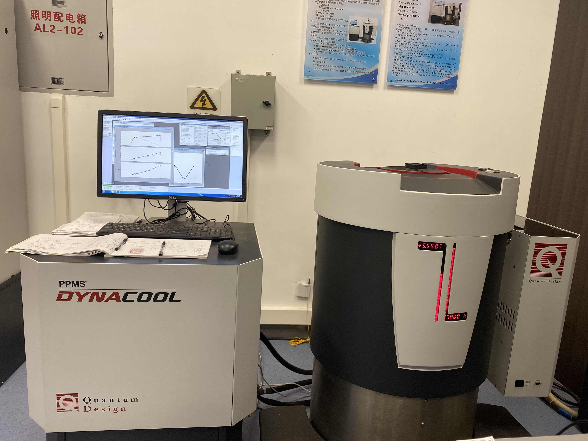
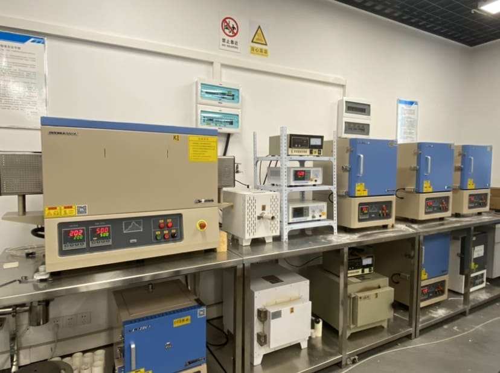
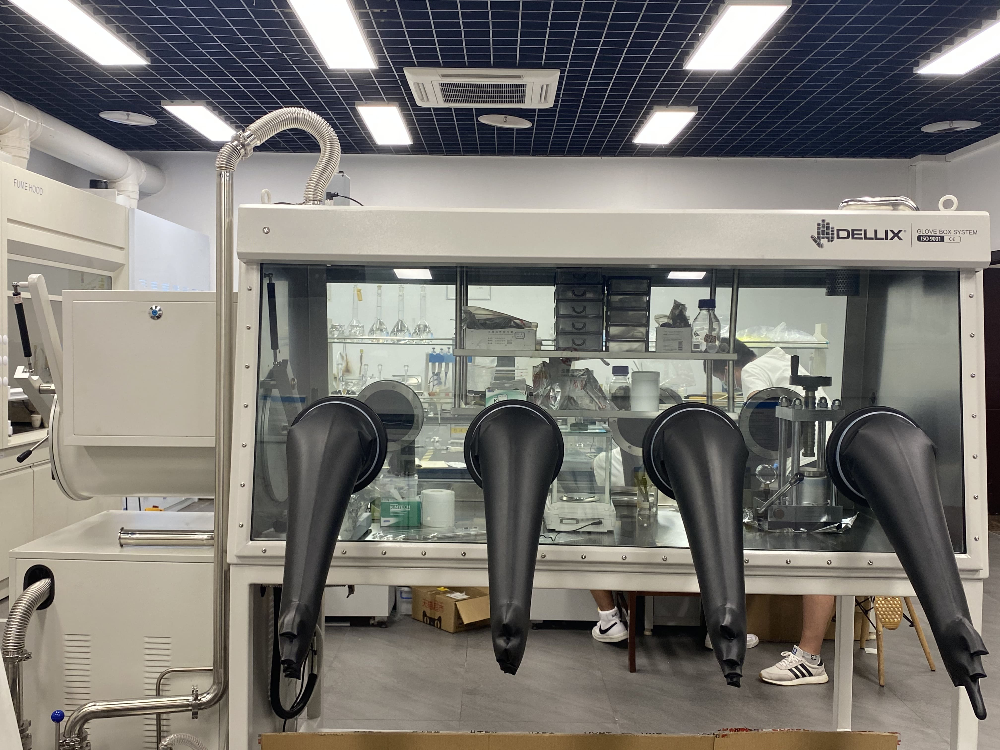

# Facillities

## Oxford Cryostat（1.4 K, 14 T）
{: style="height:270px;width:360px"}

## Quantum Design Dynacool（2 K, 9 T）
{: style="height:270px;width:360px"}

## Sample Growth Frunaces
{: style="height:270px;width:361.2px"}

## Glove Box
{: style="height:270px;width:360px"}